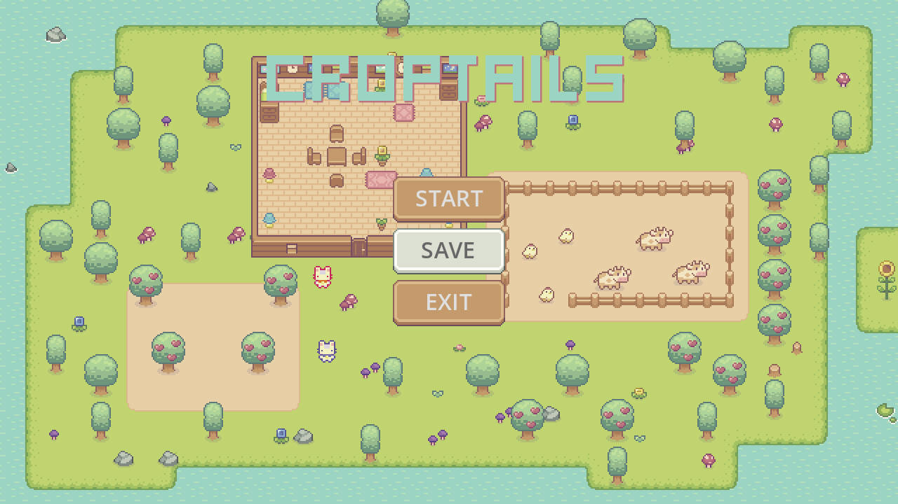
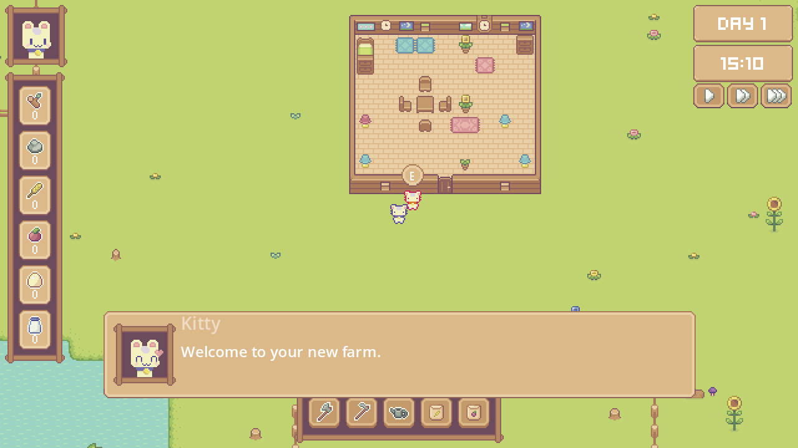
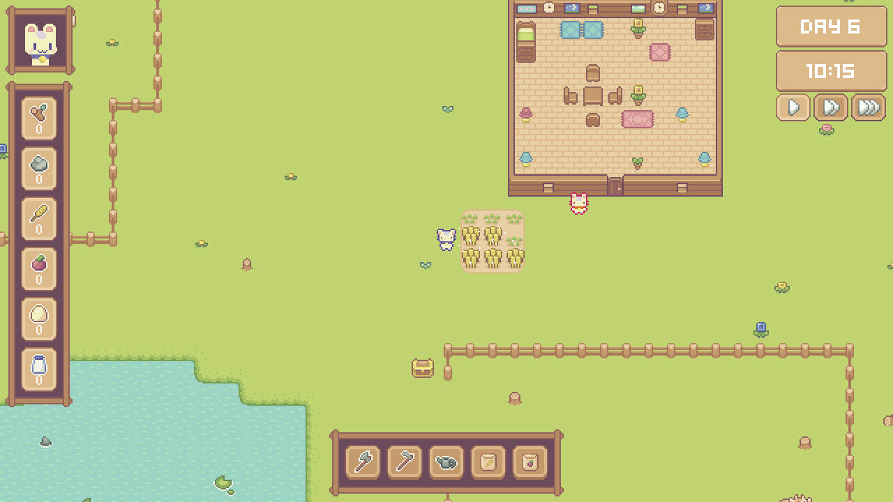

# Croptails

## 介绍

类萌芽岛种田小游戏，分享我的独立游戏开发学习过程。

这个是一个十分不错的课程，开发版本Godot4.3，[Youtube](https://www.youtube.com/watch?v=it0lsREGdmc&t=3s)，[BiliBili](https://www.bilibili.com/video/BV1YhSXYTE51?p=25&vd_source=a49e175e84c42d23d87a620add615b1d)

在这里你可以学到：

1. 使用自己编写的状态机代码
2. 创建可重复利用的组件
3. npc对话系统
4. 时间系统
5. 库存系统（背包系统青春版）
6. 种植系统
7. 存档系统
8. 导航寻路系统

这个9个小时的视频可以学到很多技术，并构建一个完整的种田小游戏，但是仍然有许多bug，需要我们真正学会技术，然后自己动手解决。

## 后续学习

可以以这个TopDown视角的游戏为基础继续后面的学习，例如添加一些新功能：

1. 战斗系统
2. 敌人
3. 完整的背包系统
4. 炫酷的shader
5. 让游戏活灵活现的Tween动画

## 开始菜单

 

## NPC对话

 

## 种植

 

